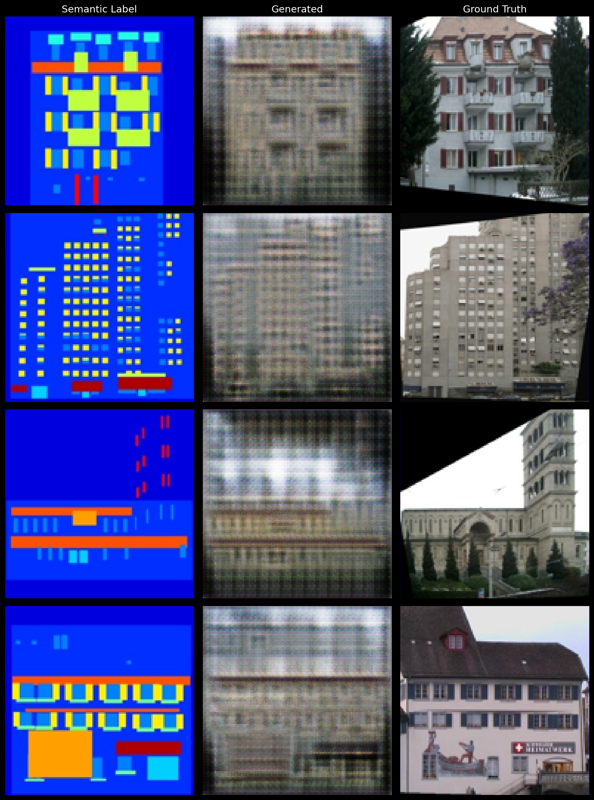
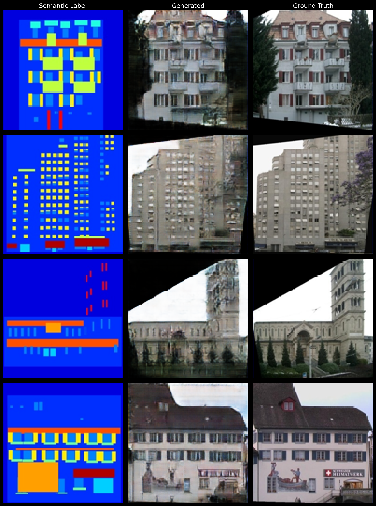
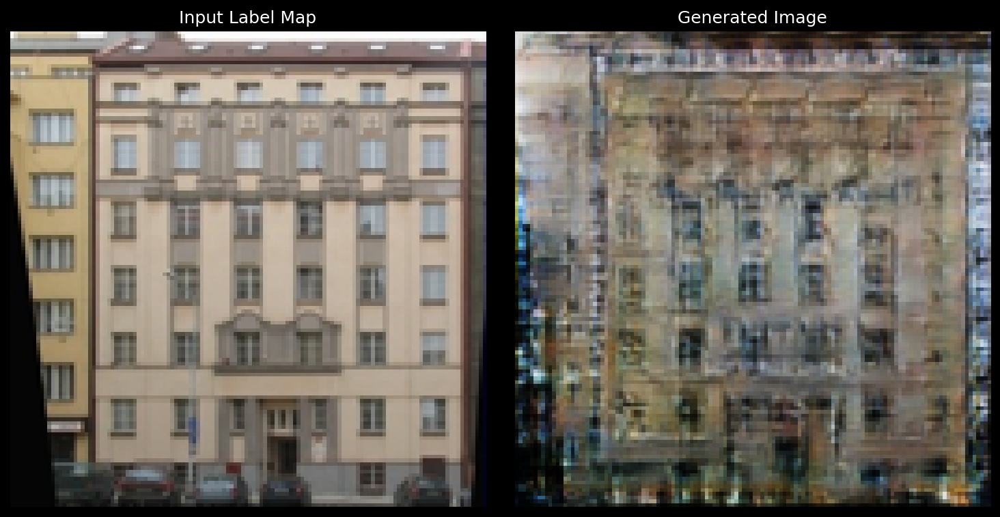
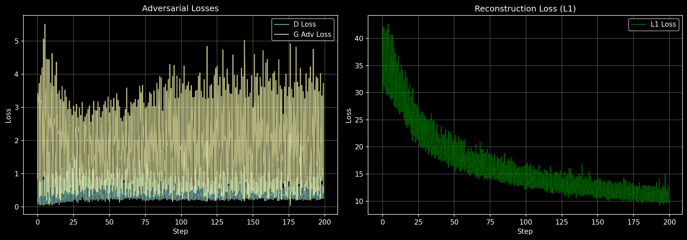

# Image Synthesis from Semantic Labeling


**Course:** Generative AI Models
**University:** National Polytechnic University of Armenia
**Department:** Department of Computer Science
**Professor:** Prof. Avetisyan Varazdat
**Semester:** Spring 2026

**Students: Sona Davtyan, Emilia Nahapetyan**


A complete from-scratch implementation of a **Conditional GAN (Pix2Pix-style)** for generating photorealistic images from semantic label maps, built entirely with PyTorch primitives.

```
Semantic Label Map ──► U-Net Generator ──► Synthesized Image
                             ▲
                             │ Adversarial + L1 Loss
                             ▼
                       PatchGAN Discriminator ◄── Real Image
```

---

## Table of Contents

- [Overview](#overview)
- [Architecture](#architecture)
- [Loss Functions](#loss-functions)
- [Dataset](#dataset)
- [Configuration](#configuration)
- [Training](#training)
- [Results](#results)
- [Training Logs](#training-logs)
- [Project Structure](#project-structure)
- [Requirements](#requirements)


---

## Overview

This project implements image-to-image translation using a conditional adversarial network trained to convert semantic segmentation maps into photorealistic building facade images. Every component generator, discriminator, loss functions, and data pipeline is written from scratch using raw PyTorch operations (no pretrained weights, no third-party GAN libraries).

**Key highlights:**
- U-Net generator with 8-level encoder-decoder and skip connections
- PatchGAN discriminator operating on 70×70 receptive field patches
- Three complementary loss functions (GAN + L1 + optional Feature Matching)
- CMP Facades dataset (400 training images, auto-downloaded)
- Full training pipeline with checkpointing, visual samples, and CSV loss logging

---

## Architecture

### U-Net Generator

The generator follows a symmetric encoder-decoder structure with skip connections at every resolution level, preventing information bottlenecks.

```
Input [B, 3, 256, 256]
        │
  ┌─────▼──────────────────────────────────────────────────┐
  │  ENCODER (8 downsampling blocks)                       │
  │  Conv(4×4, stride=2) → BatchNorm → LeakyReLU(0.2)      │
  │                                                        │
  │  e1: [B,  64, 128, 128]  (no BN on first block)        │
  │  e2: [B, 128,  64,  64]                                │
  │  e3: [B, 256,  32,  32]                                │
  │  e4: [B, 512,  16,  16]                                │
  │  e5: [B, 512,   8,   8]                                │
  │  e6: [B, 512,   4,   4]                                │
  │  e7: [B, 512,   2,   2]                                │
  │  e8: [B, 512,   1,   1]  ← bottleneck                  │
  └────────────────────────────────────────────────────────┘
        │ skip connections (concatenated in decoder)
  ┌─────▼──────────────────────────────────────────────────┐
  │  DECODER (7 upsampling blocks)                         │
  │  ConvTranspose(4×4, stride=2) → BatchNorm → Dropout    │
  │  → ReLU + skip concat from matching encoder level      │
  │                                                        │
  │  d1: [B,  512,  2,  2]  (+ e7 skip → 1024 channels)    │
  │  d2: [B,  512,  4,  4]  (+ e6 skip → 1024 channels)    │
  │  d3: [B,  512,  8,  8]  (+ e5 skip → 1024 channels)    │
  │  d4: [B,  512, 16, 16]  (+ e4 skip)                    │
  │  d5: [B,  256, 32, 32]  (+ e3 skip)                    │
  │  d6: [B,  128, 64, 64]  (+ e2 skip)                    │
  │  d7: [B,   64,128,128]  (+ e1 skip)                    │
  └────────────────────────────────────────────────────────┘
        │
  ConvTranspose → Tanh → Output [B, 3, 256, 256]
```

**Verified output shape:** `torch.Size([1, 3, 256, 256]) → torch.Size([1, 3, 256, 256])`  
**Total parameters:** 54,414,531

### PatchGAN Discriminator

Rather than classifying the entire image as real/fake, the PatchGAN classifies overlapping 70×70 patches. This encourages fine-grained texture realism and allows the discriminator to operate efficiently on arbitrary image sizes.

The discriminator is conditioned on both the semantic label map and the image (real or generated), concatenated along the channel dimension:

```
Input: label [B, 3, 256, 256] + image [B, 3, 256, 256]
       → concat → [B, 6, 256, 256]
         │
   Block 1: Conv(4×4, s=2) → LeakyReLU(0.2)         → [B,  64, 128, 128]
   Block 2: Conv(4×4, s=2) → BN → LeakyReLU(0.2)    → [B, 128,  64,  64]
   Block 3: Conv(4×4, s=2) → BN → LeakyReLU(0.2)    → [B, 256,  32,  32]
   Block 4: Conv(4×4, s=1) → BN → LeakyReLU(0.2)    → [B, 512,  31,  31]
   Output:  Conv(4×4, s=1)                            → [B,   1,  30,  30]
         │
   Each of the 30×30 = 900 values judges one 70×70 patch
```

**Feature map shapes (verified):**
```
[B, 64, 128, 128]  →  [B, 128, 64, 64]  →  [B, 256, 32, 32]  →  [B, 512, 31, 31]
```
**Total parameters:** 2,768,705

---

## Loss Functions

Three loss components are combined during generator training:

| Loss | Formula | Weight | Purpose |
|------|---------|--------|---------|
| **GAN Loss** | BCE or LSGAN | 1.0 | Adversarial — trains G to fool D |
| **L1 Reconstruction** | `mean(|G(x) - y|)` | λ\_L1 = 100 | Pixel-level fidelity to ground truth |
| **Feature Matching** | L1 on D's intermediate features | λ\_FM = 10 | Match statistical texture properties |

**Verified loss values (untrained network):**
```
GAN loss (real): 0.8113
GAN loss (fake): 0.7946
L1 loss:        112.5110
FM loss:         11.2634
```

The generator minimizes:
```
L_G = L_GAN(G) + λ_L1 · L_L1(G, y) + λ_FM · L_FM(G, y)
```

The discriminator minimizes:
```
L_D = L_GAN(real) + L_GAN(fake)
```

---

## Dataset

### CMP Facades

The notebook uses the **CMP Facades** dataset (~29 MB, auto-downloaded), a standard benchmark for image-to-image translation tasks.

- **400 training images**, 100 validation images
- Each file is a horizontally concatenated pair: `[photo | semantic label map]`
- Direction: `BtoA` (photo → label map translation)

**Verified data loading:**
```
Label batch: torch.Size([8, 3, 128, 128]),  range [-1.00, 1.00]
Real batch:  torch.Size([8, 3, 128, 128]),  range [-1.00, 1.00]
Training images: 400
```

### Sample Training Pairs

Each sample consists of a real facade photograph paired with its semantic segmentation label map. The label map encodes architectural elements (walls, windows, doors, balconies, etc.) with distinct colors.

```
┌────────────────┬────────────────┐
│  Semantic Map  │   Real Photo   │
│  (model input) │ (ground truth) │
├────────────────┼────────────────┤
│ Color-coded    │ Photorealistic │
│ region labels  │ facade image   │
└────────────────┴────────────────┘
```

### Data Augmentation

During training, the following augmentations are applied to improve generalization:

- Random horizontal flip (p=0.5)
- Random crop from slightly larger resized image
- Normalization to `[-1, 1]` range for Tanh output compatibility

---

## Configuration

All hyperparameters are centralized in the `Config` class:

```python
class Config:
    # Data
    image_size    = 128          # Input/output resolution
    batch_size    = 8
    direction     = "BtoA"       # BtoA = photo→label, AtoB = label→photo

    # Generator (U-Net)
    ngf           = 64           # Base filter count
    unet_depth    = 7            # Downsampling depth
    gen_dropout   = 0.5          # Dropout in first 3 decoder blocks

    # Discriminator (PatchGAN)
    ndf           = 64
    n_layers_d    = 3

    # Training
    epochs        = 200
    lr_g          = 2e-4         # Generator learning rate
    lr_d          = 2e-4         # Discriminator learning rate
    beta1         = 0.5          # Adam β₁
    beta2         = 0.999        # Adam β₂
    lambda_l1     = 100.0        # L1 reconstruction weight
    lambda_fm     = 10.0         # Feature matching weight
    use_feature_matching = False

    # Logging
    save_interval   = 10         # Checkpoint every N epochs
    sample_interval = 5          # Save visual samples every N epochs
```

---

## Training

### Procedure

Training follows the standard alternating adversarial optimization:

**Step 1 — Update Discriminator:**
```
1. Generate fake image:  fake = G(label)
2. D sees (label, real) → predict real  → compute D_loss_real
3. D sees (label, fake) → predict fake  → compute D_loss_fake
4. D_loss = (D_loss_real + D_loss_fake) / 2
5. Backprop and update D parameters
```

**Step 2 — Update Generator:**
```
1. Generate fake image:  fake = G(label)
2. D evaluates (label, fake) → G wants D to predict "real"
3. G_loss = L_GAN(G) + λ_L1 · L1(fake, real) [+ λ_FM · FM(fake, real)]
4. Backprop and update G parameters
```

### Outputs

During training, the following are saved automatically:

| Output | Location | Frequency |
|--------|----------|-----------|
| Model checkpoints | `outputs/checkpoints/` | Every 10 epochs |
| Visual sample grids | `outputs/samples/` | Every 5 epochs |
| Loss CSV logs | `outputs/logs/` | Every batch |
| Final inference | `outputs/inference/` | End of training |

---

## Results


### Output Format

At inference time, the model produces a triplet for each sample:

```
┌──────────────────────────────────────────────────────┐
│  Semantic Label  │  Generated Image  │  Ground Truth │
│   (model input)  │   (G output)      │  (real photo) │
└──────────────────────────────────────────────────────┘
```


Sample grids are saved to `outputs/samples/epoch_XXX.png` every 5 epochs, allowing visual monitoring of training progression.

Early training sample (epoch 5): 


Late training sample (epoch 200):

### Single Image Inference

The trained model can synthesize facade images from any semantic label map:




---

## Training Logs

### Loss Curves

After training, loss curves are plotted from the per-epoch history:

```python
fig, (ax1, ax2) = plt.subplots(1, 2, figsize=(14, 5))

# Left plot: epoch-level D and G losses
ax1.plot(history["epoch"], history["d_loss"], label="Discriminator")
ax1.plot(history["epoch"], history["g_loss"], label="Generator (total)")

# Right plot: per-step detail from CSV
logger.plot_losses(output_path=cfg.log_dir / "loss_curves.png")
```

**Expected loss dynamics:**

| Phase | Discriminator | Generator |
|-------|-------------|-----------|
| Early training | Falls quickly as D learns | High, as G produces noise |
| Mid training | Stabilizes ~0.5–0.7 | Gradually decreases |
| Convergence | Fluctuates around 0.5 | Plateaus at low value |

The discriminator and generator engage in a minimax game: D tries to distinguish real from fake while G tries to fool D. Healthy training shows both losses converging without one completely dominating the other.

**Actuall loss dynamics:**



---

## Project Structure

```
image_synthesis_semantic_labeling/
│
├── image_synthesis_semantic_labeling.ipynb   ← Main notebook
│
├── data/
│   └── facades/
│       ├── train/        ← 400 paired training images
│       └── test/         ← Validation/test images
│
├── outputs/
│   ├── checkpoints/      ← Model weights (latest.pth, epoch_XXX.pth)
│   ├── samples/          ← Visual grids saved every 5 epochs
│   ├── logs/             ← loss.csv, loss_curves.png
│   └── inference/        ← Single-image inference outputs
│
└── facade_painter.py     ← Exported interactive GUI app
```

---

## Requirements

```
torch >= 1.12
torchvision
Pillow
numpy
matplotlib
```


---


All GAN components are written entirely from scratch using PyTorch primitives — no pretrained weights, no external GAN libraries.